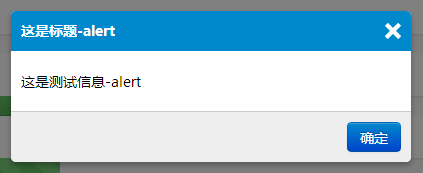
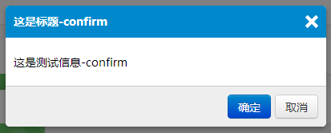
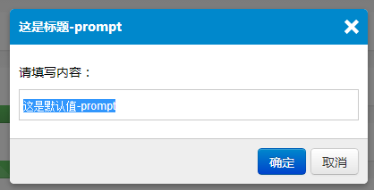
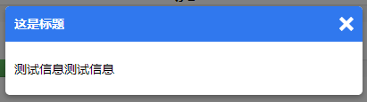
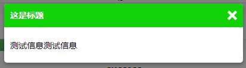
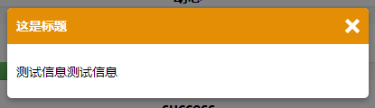
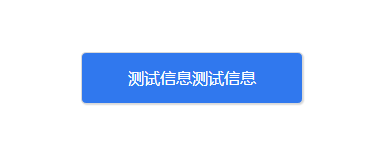

##用法

jPops依赖于```jQuery```，jPop主体js```jquery.jpops.js```,jPops样式```jpops.source.css```

**例子alert：**
```js
$.jPops.alert({
    title:"这是标题-alert",
    content:"这是测试信息-alert",
    okButton:"确定",
    callback:function(r){
        if(r){
            console.log("我是alert的回调")
        }
    }
});
```


**例子confirm：**
```js
$.jPops.confirm({
    title:"这是标题-confirm",
    content:"这是测试信息-confirm",
    okButton:"确定",
    cancelButton:"取消",
    callback:function(r){
        if(r){
            console.log("我是confirm的回调,true");
        }
        else{
            console.log("我是confirm的回调,false");
        }
    }
});
```


**例子prompt：**
```js
$.jPops.prompt({
    title:"这是标题-prompt",
    content:"请填写内容：",
    defaultValue:"这是默认值-prompt",
    okButton:"确定",
    cancelButton:"取消",
    callback:function(val){
        if(val){
            console.log("我是prompt的回调,value:"+val);
        }
        else{
            console.log("我是prompt的回调,value:"+val);
        }
    }
});
```



**例子message：**
```js
$.jPops.message({
    title:"这是标题",
    content:"测试信息测试信息",
    messageType:mtype,
    messageTimging:3000,
    callback:function(r){
        if(r){
            console.log("我是message的回调");
        }
    }
});
```






**例子message：**

```js
$.jPop({
    type:"message",
    content:"测试信息测试信息",
    messageOpts:{
        type:"info",
        timing:4000
    },
    callback:function(){
        console.log("我是回调")
    }
});
```



**<a href="http://iancj.com/jPops/" target="_blank">点击查看更多例子</a>**

jPops使用了bootstrap2的按钮样式，可以在jpops.css中修改将样式为任何样子

##参数

- **verticalOffset** 垂直偏移量（px）
- **horizontalOffset** 水平偏移量（px）
- **repositionOnResize** 当页面改变大小时自动调整位置
- **overlayOpacity** 遮罩层透明度
- **overlayColor** 遮罩层背景色
- **okButton** 确定按钮的显示文字
- **okButtonClass** 确定按钮的样式
- **cancelButton** 取消按钮的显示文字
- **cancelButtonClass** 取消按钮的样式
- **type** 弹出类型
- **title** jPop的标题
- **content** jPop的内容
- **value** jpop prompt类型的默认值
- **messageOpts** 弹出类型为message时的配置
- **------type** 弹出类型为message时的状态
- **------timing** 显示时间
- **callback:function(){}** 回调函数